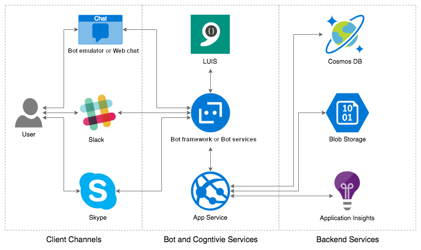
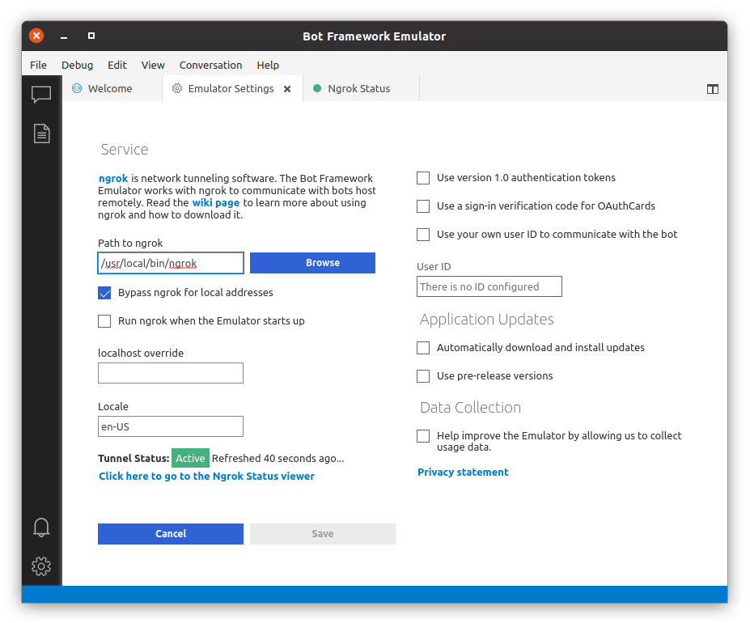
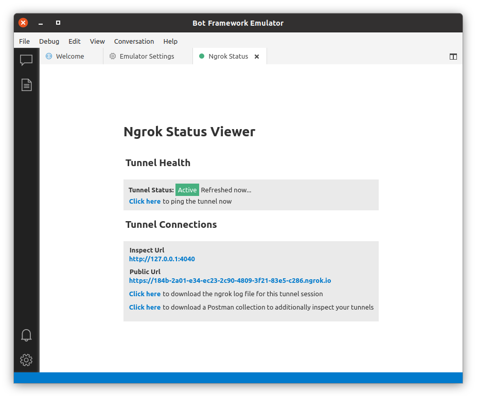
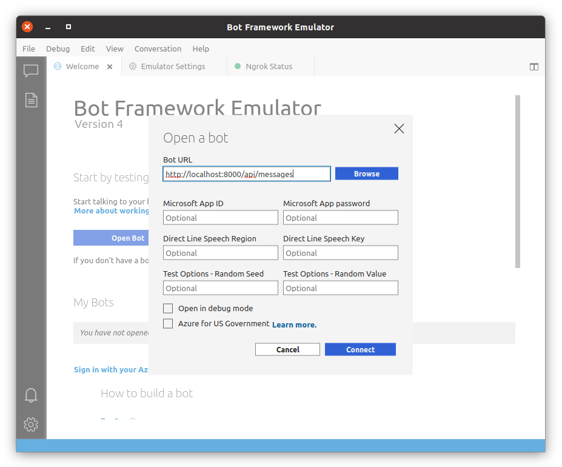
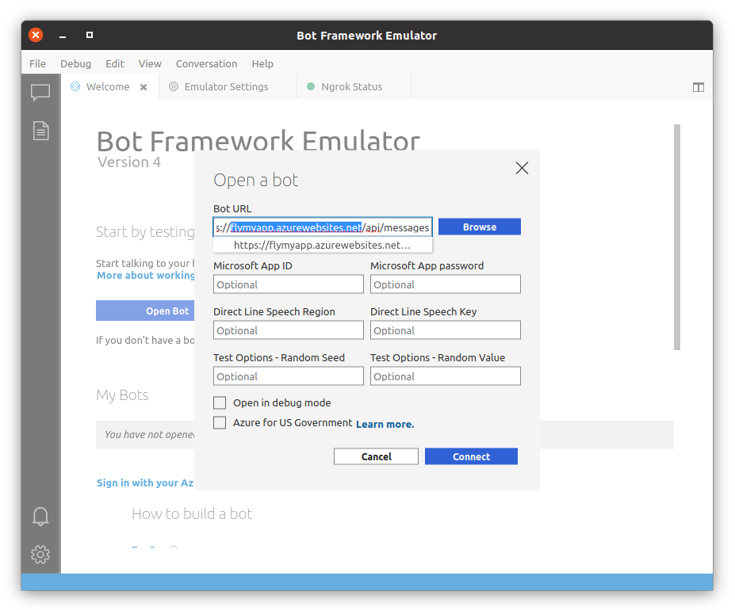
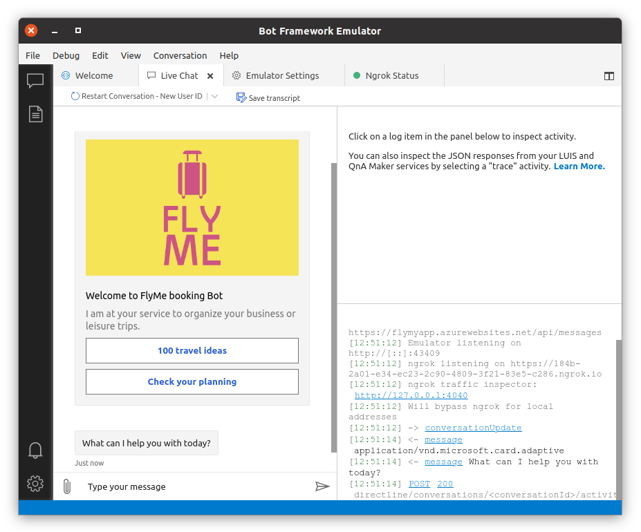
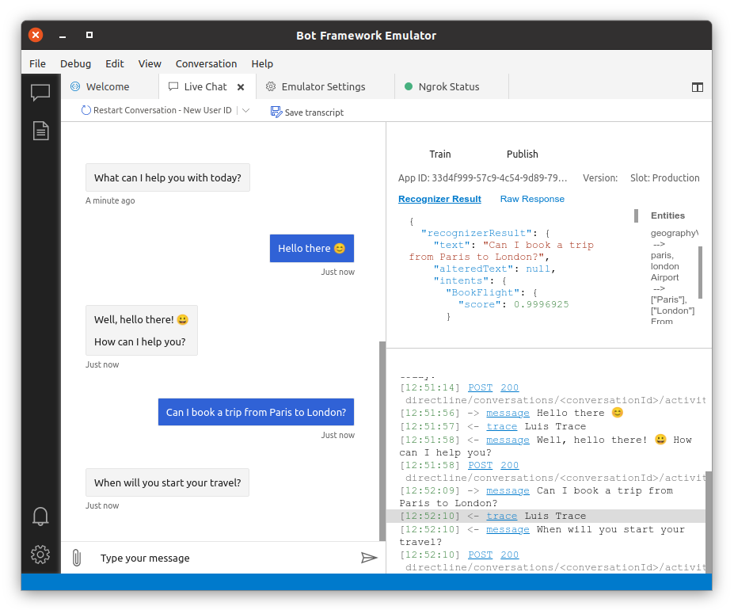
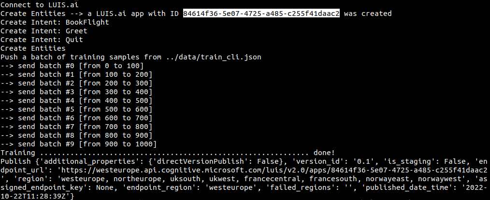
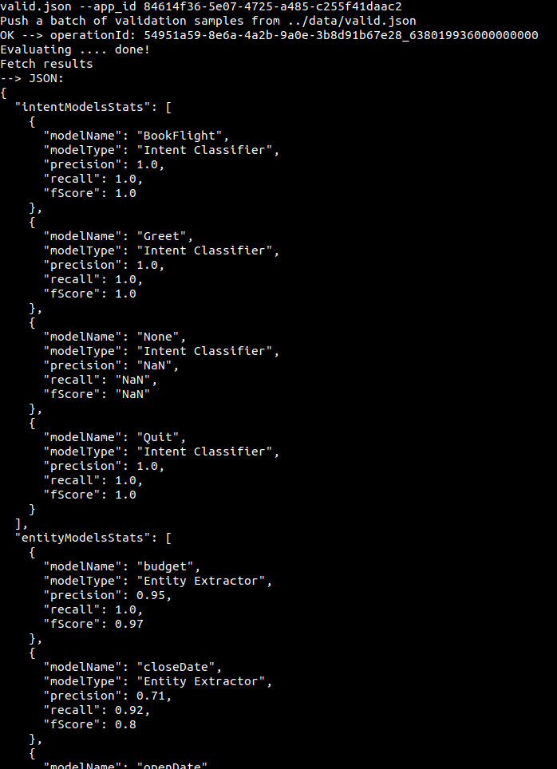
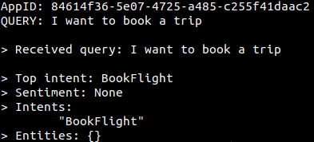

# AI chat-bot: enterprise-grade conversational AI experiences.
## ("Développez un chat-bot pour réserver des vacances")

[This project is part of the AI Engineer class on OpenClassrooms]


We are provided with a [Frames dataset](https://www.microsoft.com/en-us/research/project/frames-dataset/download/) (or [here](https://s3-eu-west-1.amazonaws.com/static.oc-static.com/prod/courses/files/AI+Engineer/Project+10%C2%A0-+D%C3%A9veloppez+un+chatbot+pour+r%C3%A9server+des+vacances/frames.zip)) from Microsoft containing **1369 full dialogues** between a 20 customers and a *customer service / bot* whose intents are to *book travels or accomodations*.

- Each dialogue has 15 turns in average, so there is 19.986 turns available in total.
- Each turns has informations about associated entities such as the `origin`, the `destination`, the `departure date`, the `return date` or the `budget`...

>#### The purpose of this project is to explore and train on va	rious services such as:
> - Microsoft **[Bot-Framework](https://github.com/microsoft/botbuilder-python)**
> - Microsoft **[Bot-Emulator](https://github.com/microsoft/BotFramework-Emulator)**
> - Microsoft **[Azure Language understanding](https://learn.microsoft.com/en-us/azure/cognitive-services/language-service/conversational-language-understanding/overview)** *([Luis.ai](https://www.luis.ai/))*
> - Microsoft **[Azure Web app](https://azure.microsoft.com/en-us/products/app-service/web/)**
> - Microsoft **[Azure Insights / Monitor](https://azure.microsoft.com/en-us/products/monitor/#overview)**
> - Github **[Actions](https://github.com/features/actions)**


#### Here is an exemple of pipeline we could use for this project:


#### So here is the plan:
1. At first, we will explore and **convert the Frames dataset** to match the Luis.ai input format.
2. Then we will **setup the various Azure services** *(Luis.ai / Web-app / Insights)*.
3. After that will **manually train and evaluate Luis.ai models** using their Luis.ai portal.
4. Next, will write scripts in order to **automatically create, train and evaluate Luis.ai models**.
5. Then, we will confifure the **GitHub Actions workflow** file to **automatically deploy our project on the web-app** on each Git push.
6. After that, we will **setup a simple booking chat-bot server** using the [13.core-bot](https://github.com/microsoft/botbuilder-samples/tree/main/samples/python/13.core-bot) Bot-framework sample and connect it to the Luis model.
7. Next, we will **add Insights Telemetry** using the [21.corebot-app-insights](https://github.com/microsoft/botbuilder-samples/tree/main/samples/python/21.corebot-app-insights) Bot-framework sample as reference.
8. Finally, we will **configure Azure Monitor alerts** and **setup a Dashboard** to keep an eye on our project.

---

## Setting up the project / Running the notebooks locally

In order to use this project locally, you will need to have Python and Jupyter notebook installed.
Once done, we can set the environment by using the following commands:


> #### First, 
> let's duplicate the project github repository
>
> ```bash
> >>> git clone https://github.com/Valkea/OC_AI_10
> >>> cd OC_AI_10
> ```

> #### Secondly,
>let's download the [dataset](https://s3-eu-west-1.amazonaws.com/static.oc-static.com/prod/courses/files/AI+Engineer/Project+10%C2%A0-+D%C3%A9veloppez+un+chatbot+pour+r%C3%A9server+des+vacances/frames.zip) and unzip it in the 'data' folder
> * data/frames.json

> #### Thirdly,
> let's create a virtual environment and install the required Python libraries
>
> (Linux or Mac)
> ```bash
> >>> python3 -m venv venvP10
> >>> source venvP10/bin/activate
> >>> pip install -r requirements.txt
> >>> pip install -r requirements-notebook.txt # only if you don't already have the `pandas` and `numpy` lib installed on your environment
> ```
>
> (Windows):
> ```bash
> >>> py -m venv venvP10
> >>> .\venvP10\Scripts\activate
> >>> py -m pip install -r requirements.txt
> >>> py -m pip install -r requirements-notebook.txt # only if you don't already have the `pandas` and `numpy` lib installed on your environment
> ```

> #### (OPTIONAL) Finally,
> if you don't already have the `pandas` and `numpy` libs installed in your Jypiter environement, you can give share your virtual environement (venvP10) with the notebook by using the following steps:
>
> ##### Install jupyter kernel for the virtual environment using the following command:
>
> ```bash
> >>> pip install ipykernel
> >>> python -m ipykernel install --user --name=venvP10
> ```
>
> ##### Select the installed kernel
> 
> In order to run the various notebooks, you will need to use the virtual environnement created above.
So once the notebooks are opened (see below), prior to running it, follow this step:
 

> ##### Run the jupyter notebooks
>
> To see the notebooks, run:
> ```bash
> >>> jupyter lab
> ```
>
> * `01_EDA_and_Preprocess.ipynb` shows the notebook with some simple EDA and the preprocessing process used to convert Frames to LUIS.ai formats *(there are 2 differents formats for the portal and the api...)*

## Running the chat-bot server locally 
You can run the chat-bot server locally, but it will still need an internet connection to reach the Luis.ai API and understand the provided sentences.

Move to the fly-me-bot folder:
```bash
>>> cd fly-me-bot
```

Then execute the chat-bot server:
```bash
(venvP10) >>> python -m aiohttp.web -H 0.0.0.0 -P 8000 app:init_func
OR
(venvP10) >>> puthon app.py  # it will run on a different PORT in this case *(check the provided port and use it in the Bot-Emulator URL paramater)*
```

After that, you can test the FlyMe-bot with the Bot-Emulator as explained in the next section.
And once the test are done, you can stop the server, with CTRL+C


## Testing the model with the Bot-Emulator
The chat-bot can be connected to various clients such as Web-chat, Slack, Skype etc. but the easiest way to test our chat-bot server is to use the Bot-Emulator.

> #### 1. Install the [BOT-Emularor](https://github.com/microsoft/BotFramework-Emulator)
> Depending on your OS, don't forget to give execution rights if needed.
> Here is the process for Linux:
> ```bash
> >>> chmod a+x BotFramework-Emulator-4.14.1-linux-x86_64.AppImage
> ```

> #### 2. Install [Ngrok tunneling 2.3.40](https://bin.equinox.io/a/ebw3zE8uejc/ngrok-2.3.40-linux-amd64.deb) *(the Bot-Emulator doesn't seems to work with the most recent versions)*
> It is used to avoid problems with firewalls when calling the Luis.ai API

> #### 3. Run the Bot-Emulator
> Set-up the path to your Ngrok executable<br>
> 
>
> Then make sure the Ngrok tunneling is `active`<br>
> 
>
> After that, you can connect to the local chat-bot server *(if you started one)*<br>
> 
>
> Or directly connect to the chat-bot server hosted on an Azure web-app<br>
> 
>
> Then if everything works as expected *(I won't keep the Azure web-app running forever)* you should be welcomed by the FlyMe Bot<br>
> 

> Finally, you can try various booking scenarios *(and explore the traces sent by Luis to better understand its answers)*<br>
> 


## Running the pipeline to create / train / test the Luis.ai models with Python scripts

> #### 1. Move to the luis-scripts folder:
> ```bash
> >>> cd luis-scripts
> ```

> #### 2. Setup the virtual environement
> The luis-scripts use a different version of the luis library than the server *(because of compatibility problems)*, so we need to set-up a different virtual environment
> So let's create a new virtual environment and install the required Python libraries
>
> (Linux or Mac)
> ```bash
> >>> python3 -m venv venvLuis
> >>> source venvLuis/bin/activate
> >>> pip install -r requirements.txt
> ```
>
> (Windows):
> ```bash
> >>> py -m venv venvLuis
> >>> .\venvLuis\Scripts\activate
> >>> py -m pip install -r requirements.txt
> ```

> #### 3. Automatically `build` and `train` a new Luis.ai model
> the script needs the path to the json file containing the `training dataset`.
> ```bash
> (venvLuis) >>> python authoring.py ../data/train_cli.json 
> ```
> <br>
> 
> Carefully copy/save the APP ID *(the selected string on the screen)*, because you will need it to call the other scripts.

> #### 4. Automatically `test` a Luis.ai model
> the script needs the path to the json file containing the `validation dataset`, and the APP_ID previously gathered while creating the model.
> ```bash
> (venvLuis) >>> python evaluate.py --valid_path ../data/valid.json --app_id YOUR_APP_ID
> ```
> <br>
> 

> #### 5. Predict intent for a given sentence
> This script is not very usefull, but it shows how to query Luis.ai with a single utterance...
> ```bash
> (venvLuis) >>> python predict.py -t "I want to book a trip" --app_id YOUR_APP_ID
> ```
> <br>
> 


## Uninstalling the venv kernel if installed
Once done with the project, the kernel can be listed and removed using the following commands:

```bash
>>> jupyter kernelspec list
>>> jupyter kernelspec uninstall venvp10
```
